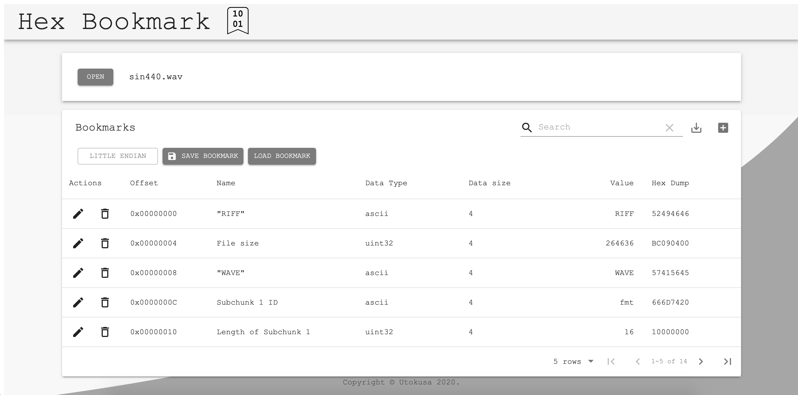

## Demo
[https://utokusa.github.io/hex_bookmark/](https://utokusa.github.io/hex_bookmark/)

## What is this?
Hex Bookmark is a binary viewer web app that uses tables. You can register the offset you want to see as a row (bookmark) in the table, so you don't have to search for the data you want to see from a conventional hard-to-see hex dump. The data type (int32, float, ascii, etc ...) can be specified for each offset, so it is easy to see a binary file containing different data types.

## Feature

- Add / edit / delete offsets (bookmarks) containing the data you want to see
- View hex dump of bookmarked offsets.
- Display of bookmarked offsets in user specified data type.
- Data types that can be specified by users: int8, uint8, int16, uint16, int32, uint32, float32, float64, ascii
- Byte order switching: little endian / big endian
- When the data type is set to ascii, the data can be displayed with the specified number of characters by editing the data size
- Data sorting
- Save / load bookmarks locally
- Export to csv file